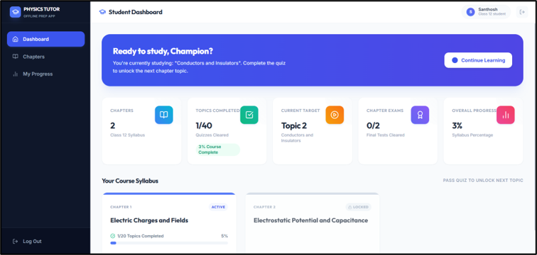
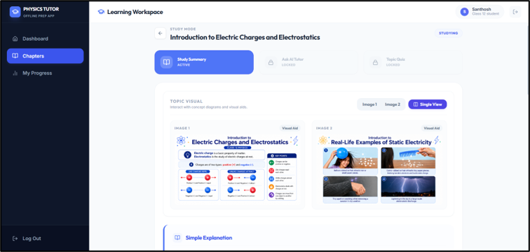
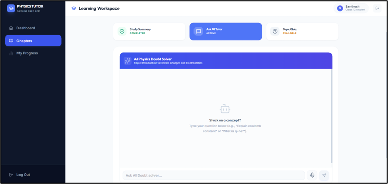
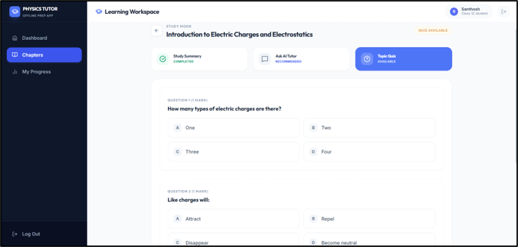
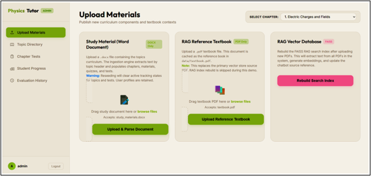
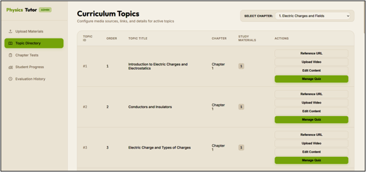
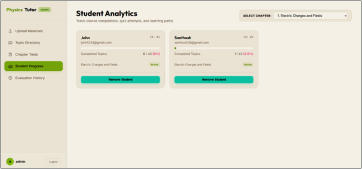

# 🎓 AI-Based Multimodal Intelligent Tutoring System Using RAG

> An offline, AI-powered Physics tutoring platform for Class 12 students, leveraging Retrieval-Augmented Generation (RAG) for intelligent, context-aware learning experiences.

---

## 📌 Overview

This system is a full-stack **Multimodal Intelligent Tutoring System (ITS)** that combines:

- 🧠 **RAG (Retrieval-Augmented Generation)** for grounded, accurate AI responses
- 🏙️ **AI Doubt Solver** with voice input (Speech-to-Text)
- 📈 **Adaptive Learning Path** with topic unlocking via quizzes
- 🖼️ **Visual Study Aids** — concept diagrams and real-life images per topic
- 🛠️ **Admin Dashboard** for uploading curriculum content and tracking student analytics
- 🔒 **Fully Offline** — no internet required during student sessions

---

## 📸 Screenshots

### 🏠 Student Dashboard


### 📖 Learning Workspace — Study Summary


### 🤖 AI Doubt Solver (Ask AI Tutor)


### 📝 Topic Quiz


### ⚙️ Admin Panel — Upload Materials


### 📂 Admin Panel — Curriculum Topics (Topic Directory)


### 📊 Admin Panel — Student Analytics


---

## 🏗️ System Architecture

```
AI-Based-Multimodal-Intelligent-Tutoring-System-Using-RAG/
¦
+-- backend/                    # FastAPI Python backend
¦   +-- app.py                  # Main API server
¦   +-- rag_engine.py           # RAG pipeline (FAISS + Sentence Transformers)
¦   +-- database.py             # Student & curriculum data management
¦   +-- answer_generator.py     # AI answer generation via Ollama
¦   +-- evaluator.py            # Quiz evaluation logic
¦   +-- stt_engine.py           # Speech-to-Text (faster-whisper)
¦   +-- study_material.py       # Study material serving
¦   +-- ingest_pdf.py           # PDF ingestion for RAG
¦   +-- requirements.txt        # Python dependencies
¦   +-- data/                   # Storage for PDFs, vectors, student data
¦
+-- frontend/                   # React + Vite frontend
¦   +-- src/                    # React components & pages
¦   +-- admin.html              # Admin dashboard (standalone HTML)
¦   +-- admin.js                # Admin dashboard logic
¦   +-- public/                 # Static assets
¦   +-- package.json            # Node dependencies
¦
+-- images/                     # Project screenshots
+-- run_project.bat             # One-click launcher (Windows)
+-- README.md
```

---

## 🧰 Tech Stack

| Layer | Technology |
|---|---|
| **Frontend** | React 18, Vite, TailwindCSS |
| **Backend** | FastAPI, Python 3.10+ |
| **AI / LLM** | Ollama (local LLM, e.g. Llama 3) |
| **RAG Pipeline** | FAISS, Sentence-Transformers |
| **Speech-to-Text** | faster-whisper |
| **PDF Parsing** | PyMuPDF (fitz) |
| **Data Storage** | Local JSON / FAISS index |

---

## 🚀 Getting Started

### Prerequisites

- Python 3.10+
- Node.js 18+
- [Ollama](https://ollama.ai) installed and running locally
- A supported LLM pulled via Ollama (e.g., `ollama pull llama3`)

---

### 1️⃣ Clone the Repository

```bash
git clone https://github.com/Shreyas188/AI-Based-Multimodal-Intelligent-Tutoring-System-Using-RAG.git
cd AI-Based-Multimodal-Intelligent-Tutoring-System-Using-RAG
```

---

### 2️⃣ Backend Setup

```bash
cd backend

# Create and activate virtual environment
python -m venv venv
venv\Scripts\activate        # Windows
# source venv/bin/activate   # Linux/Mac

# Install dependencies
pip install -r requirements.txt

# Start the backend server
python app.py
```

The backend API will be available at: `http://localhost:8000`

---

### 3️⃣ Frontend Setup

```bash
cd frontend

# Install dependencies
npm install

# Start the development server
npm run dev
```

The student app will be available at: `http://localhost:5173`

---

### 4️⃣ Quick Launch (Windows Only)

Use the provided batch script to start both backend and frontend simultaneously:

```batch
run_project.bat
```

---

## ✨ Key Features

### 🎓 Student Features

| Feature | Description |
|---|---|
| **Structured Syllabus** | Class 12 Physics syllabus with chapter/topic hierarchy |
| **Study Summary** | AI-generated concise summaries with visual aids |
| **Visual Learning** | Concept diagrams and real-life examples per topic |
| **AI Doubt Solver** | RAG-powered Q&A with voice input support |
| **Topic Quiz** | Auto-generated MCQ quizzes to unlock next topics |
| **Progress Tracking** | Dashboard with completion %, chapter scores |

### 🛠️ Admin Features

| Feature | Description |
|---|---|
| **Upload Materials** | Upload `.docx` study documents and reference PDFs |
| **RAG Index Rebuild** | Rebuild the FAISS vector search index |
| **Topic Directory** | Configure topics, videos, URLs, and quizzes |
| **Student Analytics** | Track individual student progress and completion |
| **Chapter Tests** | Create and manage end-of-chapter assessments |

---

## 🔌 Offline Operation

This system is designed to operate **completely offline**:

- The LLM runs locally via **Ollama**
- Vector embeddings use **local Sentence-Transformers** models
- Speech recognition uses **faster-whisper** (local inference)
- All student data stored as local JSON files

No API keys or internet connection required after initial setup.

---

## 📦 Backend Dependencies

```
fastapi
uvicorn
pymupdf
sentence-transformers
faiss-cpu
numpy
requests
pydantic
faster-whisper
```

---

## 📄 License

This project is developed as part of an academic research initiative. All rights reserved.

---

## 🙏 Acknowledgements

- [Ollama](https://ollama.ai) — Local LLM inference
- [FAISS](https://github.com/facebookresearch/faiss) — Efficient similarity search
- [Sentence-Transformers](https://www.sbert.net/) — Text embeddings
- [faster-whisper](https://github.com/SYSTRAN/faster-whisper) — Local speech recognition
- [React](https://react.dev) + [Vite](https://vitejs.dev) — Frontend framework
- [FastAPI](https://fastapi.tiangolo.com) — Backend API framework

---

<div align="center">
  Made with ❤️ for smarter, accessible education
</div>
